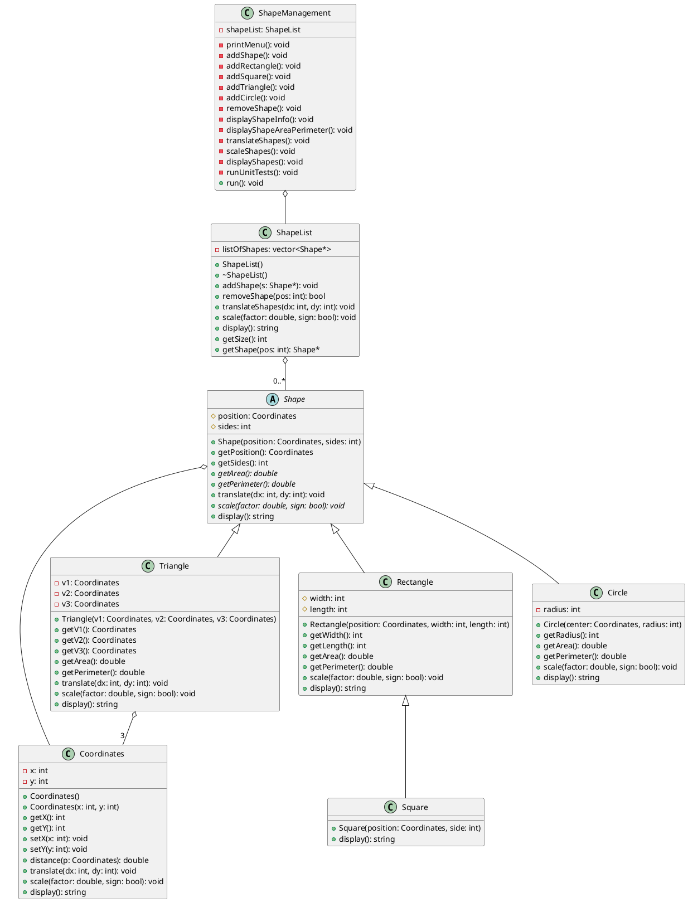

# UML Diagram for Shape Management System

Below is a PlantUML script that generates a UML class diagram for the Shape Management System. You can use this with any PlantUML tool or online service to create a diagram for your report.

## How to Use This UML Diagram

1. Copy the PlantUML code above
2. Go to an online PlantUML editor such as:
   - http://www.plantuml.com/plantuml/uml/
   - https://www.planttext.com/
3. Paste the code and generate the diagram
4. Save the resulting image for your report

The diagram shows the class hierarchy and relationships in the Shape Management System:
- Inheritance relationships between Shape and derived classes
- Composition relationships (e.g., ShapeList contains Shape objects)
- Attributes and methods for each class

This UML diagram should be included in your report to illustrate the object-oriented design of your system. 